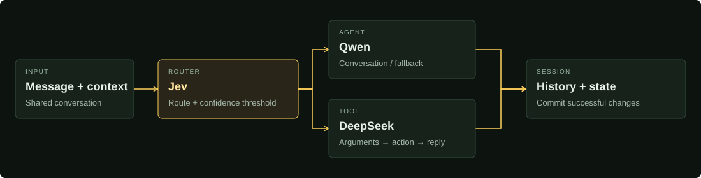

<div align="center">

<h1>Jev Intent Router</h1>
<p><strong>One conversation. Six agents. Every route in view.</strong></p>
<p>A lightweight playground for conversational agents, tools, and persistent task state.</p>

<p><code>Python 3.11+</code> &nbsp; <code>FastAPI</code> &nbsp; <code>EN / 中文</code></p>

<p>
  <a href="demo.mp4"><strong>Watch demo ↗</strong></a> &nbsp; · &nbsp;
  <a href="#quick-start">Quick start</a> &nbsp; · &nbsp;
  <a href="docs/development.md">Development guide</a> &nbsp; · &nbsp;
  <a href="README.zh-CN.md">简体中文</a>
</p>

</div>

[](demo.mp4)

<p align="center"><sub>A frame from the 35-second demo. Click the preview to watch.</sub></p>

## Explore the conversation

| Chat naturally | Follow the route | Inspect the state |
| :--- | :--- | :--- |
| Roleplay, learn English, discuss fitness or nutrition, tell a story, or just chat. | See Jev's choice, confidence, tool calls, latency, and token usage. | Track the current task, device properties, and one shared message history. |

**6 agents** — Roleplay · English teacher · Fitness coach · Nutritionist · Storyteller · Chat

**7 tools** — Set volume · Adjust volume · Shutdown · Weather · Play music · Music controls · Goodbye

## Quick start

Install [uv](https://docs.astral.sh/uv/) and Python 3.11+, then:

```sh
git clone https://github.com/wenbindu/jev-intent-router.git
cd jev-intent-router
uv sync --locked
cp config.example.yaml config.local.yaml
```

Add your Jev, Qwen, and DeepSeek API keys to `config.local.yaml`, then start:

```sh
uv run python -m intent_router
```

Open **[localhost:3000/route](http://127.0.0.1:3000/route)**. One server runs the frontend and API; no frontend build is needed. Set `server.port` or use `PORT=3107` to change the port.

## How it works



**Persistent tasks keep the context.** Agents and music playback can own the current task. Instant tools, such as volume adjustment, preserve it. Successful tool actions update state immediately, even if the final reply fails.

This is a playground: device commands are simulated and weather uses mock data. Sessions reset on reload; state and thresholds do not guarantee correct routing for every ambiguous follow-up.

## Build on it

- **[Development guide](docs/development.md)** — configuration, project structure, extensions, and current limits.
- **[State transitions](docs/session-binding-state-machine.md)** — the lightweight session model (Chinese).
- **[Routing catalog](tools.yaml)** · **[Agent prompts](intent_router/agents/prompts.py)** · **[Configuration template](config.example.yaml)**

```sh
uv run pytest -q
```

Tests use simulated model responses. Local credentials, logs, and browser test artifacts are excluded from Git.
