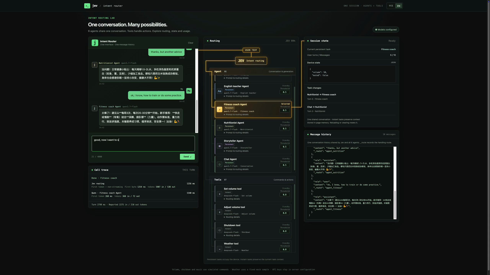
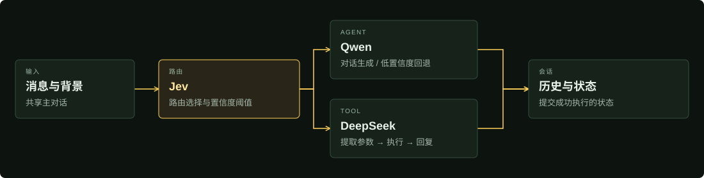

<div align="center">

<h1>Jev Intent Router</h1>
<p><strong>一段对话，六个 Agent，每条路径清晰可见。</strong></p>
<p>一个轻量的对话实验台，连接场景 Agent、工具与持久任务状态。</p>

<p><code>Python 3.11+</code> &nbsp; <code>FastAPI</code> &nbsp; <code>中文 / EN</code></p>

<p>
  <a href="demo.mp4"><strong>观看演示 ↗</strong></a> &nbsp; · &nbsp;
  <a href="#快速开始">快速开始</a> &nbsp; · &nbsp;
  <a href="docs/development.zh-CN.md">开发指南</a> &nbsp; · &nbsp;
  <a href="README.md">English</a>
</p>

</div>

[](demo.mp4)

<p align="center"><sub>截取自 35 秒演示视频，点击预览即可观看。</sub></p>

## 从对话到执行

| 自然交流 | 观察路由 | 查看状态 |
| :--- | :--- | :--- |
| 角色扮演、英语学习、健身饮食、讲故事，或者随便聊聊。 | 查看 Jev 的选择、置信度、工具调用、耗时及 token 用量。 | 跟踪当前任务、设备属性与共享主消息列表。 |

**6 个 Agent** — 角色扮演 · 英语教师 · 健身教练 · 营养师 · 讲故事 · 闲聊

**7 个工具** — 设置音量 · 调节音量 · 关机 · 天气 · 播放歌曲 · 歌曲控制 · 告别

## 快速开始

安装 [uv](https://docs.astral.sh/uv/) 和 Python 3.11+，然后运行：

```sh
git clone https://github.com/wenbindu/jev-intent-router.git
cd jev-intent-router
uv sync --locked
cp config.example.yaml config.local.yaml
```

在 `config.local.yaml` 中填写 Jev、Qwen 和 DeepSeek 的 API Key，然后启动：

```sh
uv run python -m intent_router
```

打开 **[localhost:3000/route](http://127.0.0.1:3000/route)**。前端与 API 共用一个服务，无需前端构建。修改 `server.port` 或使用 `PORT=3107` 可更换端口。

## 工作方式



**持久任务延续对话背景。** Agent 和歌曲播放可以接管当前任务；调音量等瞬时工具保留原任务。工具执行成功后立即更新状态，即使最终回复失败也保留结果。

这是一个实验项目：设备命令为模拟执行，天气采用固定样本；刷新会重置会话。状态与阈值不能保证正确理解每一种含糊追问。

## 继续开发

- **[开发指南](docs/development.zh-CN.md)** — 配置、项目结构、扩展方式与当前限制。
- **[状态转移说明](docs/session-binding-state-machine.md)** — 轻量 Session 模型。
- **[路由目录](tools.yaml)** · **[Agent 提示词](intent_router/agents/prompts.py)** · **[配置模板](config.example.yaml)**

```sh
uv run pytest -q
```

测试使用模拟模型响应。本地密钥、日志与浏览器测试产物已排除在 Git 之外。
